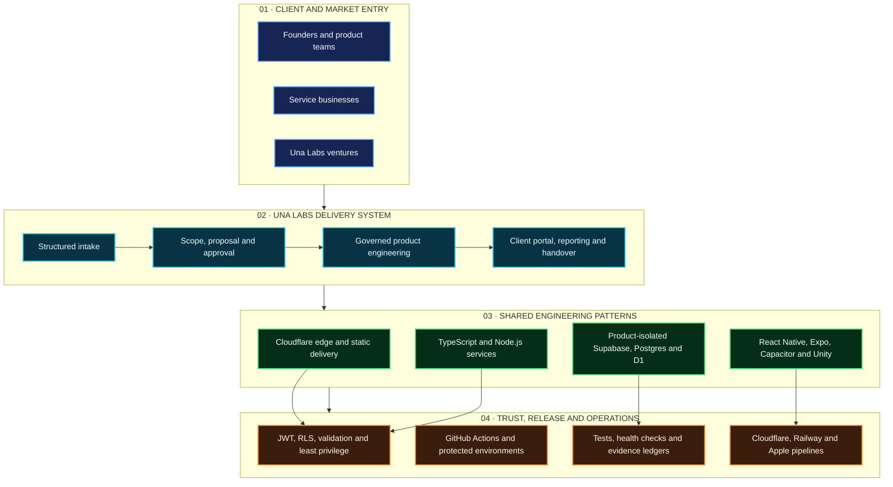

  

<h2 align="center">From rough request to shipped, supportable product.</h2>

  Una Labs is a Toronto product studio and delivery platform for founders, teams, and service businesses. We combine structured discovery, product engineering, secure AI workflows, client-facing delivery operations, and evidence-backed release governance.

  
  
  

---

## What Una Labs Does

| Capability | What clients receive |
|---|---|
| **Product discovery** | Structured intake, requirements, workflow mapping, technical options, risk boundaries, and a buildable delivery slice |
| **Product engineering** | Responsive web platforms, mobile applications, APIs, integrations, data models, automation, and release pipelines |
| **AI workflow systems** | Human-governed AI features, approval checkpoints, privacy-conscious prompts, provider boundaries, and measurable outcomes |
| **Delivery operations** | Proposals, milestones, project dashboards, approvals, reports, handover evidence, and production-readiness gates |
| **Platform improvement** | Security hardening, performance work, operational automation, health checks, cost control, and recovery documentation |

## Product and Venture Portfolio

States are stated deliberately: **live** means a public product surface exists; **staging** and **release pipeline** do not mean production readiness.

| Product | Purpose | Engineering scope | Current public position |
|---|---|---|---|
| **Una Labs Platform** | Intake-to-delivery operating system for founders and service teams | Next.js, TypeScript, Cloudflare, Supabase, Stripe, governed project workflows | [Live platform](https://unalabs.cloud) |
| **PeacePad** | Calm, privacy-aware family communication and coordination | React, TypeScript, Node.js, PostgreSQL, Railway, Cloudflare, Capacitor | [Live product](https://peacepad.ca) |
| **PeacePad V2** | Regional native-mobile coordination, secure family identity, messaging, calendar, private records, and bounded offline recovery | React Native, Expo, TypeScript, Deno Edge Functions, dual-region Supabase/Postgres, Terraform controls | **Lab/staging · release blocked** |
| **SayWetin** | Speech, music, and Nigerian-language recognition across web, extension, and mobile tracks | React, React Native, TypeScript, Node.js, PostgreSQL, Railway, Cloudflare | [Live product](https://saywetin.app) |
| **Anion** | Tutoring operations, scheduling, role-based dashboards, billing, and live-classroom workflows | Next.js, Supabase, Stripe, Daily.co, Cloudflare Workers | [Live product](https://anion.unalabs.cloud) |
| **Dispatch** | Operational dispatch, incident monitoring, mobile workflows, and protected administration | React, TypeScript, Node.js, PostgreSQL, Railway, Capacitor | [Product walkthrough](https://unalabs.cloud/demo/dispatch) |
| **ATEAM** | Mission-control and coordinated operational workflows | TypeScript, Node.js, managed runtime patterns, public/private route separation | [Status board](https://unalabs.cloud/status?project=ateam) |
| **CapSigma Growth Desk** | Lead intelligence, outreach operations, approvals, and proof-backed handover | Cloudflare Pages/Functions, D1 patterns, SendGrid, AI workflows | [Live product](https://capsigma-growth-desk.pages.dev) |
| **Garden Cleaners** | Service-business website, booking, client portal, and operational delivery | Next.js, Supabase, Stripe, Cloudflare, production QA | [Live product](https://gardencleaners.ca) |
| **Just Checking In** | Mobile game and Apple release-delivery programme | Unity, C#, iOS export, Xcode signing/archive, TestFlight and App Store workflows | **iOS release track** |

The wider delivery catalogue also includes reusable vertical concepts for skilled trades, cold-chain logistics, brand/design delivery, internal automation, browser extensions, and mobile product experiments. Private client or user-sensitive systems remain private by design.

## Company Architecture

  

<b>View the accessible technical flowchart</b>

 

## Technology Stack

| Layer | Technologies and practices |
|---|---|
| **Web experiences** | TypeScript, JavaScript, React, Next.js, Vite, Astro, Tailwind CSS |
| **Mobile and games** | React Native, Expo, Capacitor, Unity, C#, iOS, Xcode, Android |
| **APIs and edge** | Node.js, Express, Deno Edge Functions, Cloudflare Pages/Functions/Workers, REST, WebSockets |
| **Data and identity** | Supabase, PostgreSQL, D1, JWT, Row Level Security, versioned migrations |
| **Cloud and delivery** | Cloudflare, Railway, Docker, Terraform, GitHub Actions, protected environments |
| **Integrations** | Stripe, Daily.co, SendGrid, webhooks, AI providers with human approval boundaries |
| **Quality and operations** | Jest, Vitest, Playwright, contract tests, health/readiness endpoints, request tracing, proof ledgers |

## How We Build

- **Evidence before claims:** builds and static checks are not represented as production proof.
- **Privacy by design:** product data stays isolated; public repositories expose only intended surfaces.
- **Human-governed AI:** consequential AI workflows retain review and approval checkpoints.
- **Fit-for-purpose infrastructure:** edge delivery for suitable workloads; persistent compute only where required.
- **Cost-conscious operations:** standardize and consolidate before adding another paid platform.
- **Handover-ready delivery:** working software ships with documentation, access boundaries, validation, and the next operational step.

## Open Source and Engineering Evidence

The public engineering portfolio is maintained in [fefejiro/FTC-HOLDING](https://github.com/fefejiro/FTC-HOLDING). It contains product code, shared packages, platform scripts, QA workflows, operational documentation, and release evidence. Some repositories remain private because they contain client-sensitive or product-sensitive implementation details.

## Work With Una Labs

Have a rough request, an operational bottleneck, or a product that needs a reliable delivery path?

  
  
  

  

